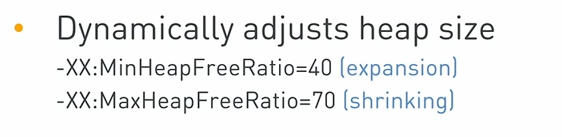
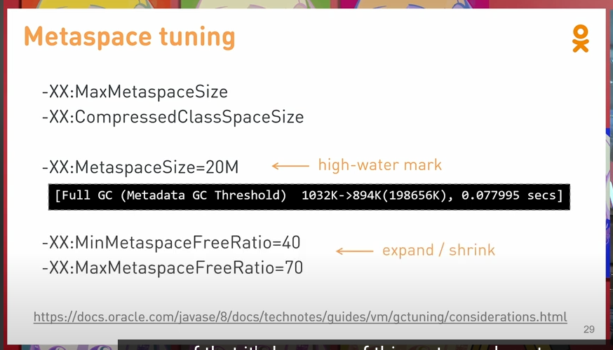
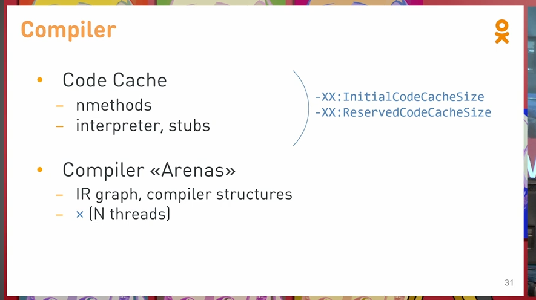

Memory footprint of a Java process

Does JVM option '-Xmx4g' mean that the process will consume up to 4 GB RAM? Certainly not. What else can take virtual
memory and how much of it?

java -Xmx4G

``` yaml
resouces:
    limits:
        cpus: '4'
        memory: 10G
```

Affets:
- Default heap size
- Visible number of CPUS.


``` shell
pmap -x <pid>

```

# 解释内存
## [Native Memory Tracking](https://docs.oracle.com/en/java/javase/11/vm/native-memory-tracking.html#GUID-39676837-DA61-4F8D-9C5B-9DB1F5147D80)

```
-XX:NativeMemoryTracking=[off | summary | detail]
```

! Note: 
* Enabling NMT causes a 5% -10% performance overhead. 
* +2workds / malloc
* allocations only inside JVM.


jcmd <pid> VM.native_memory


### 

java -Xmx4G -Xms4G 
-Xms不代表最小申请. heap仍然可以自动调节，如果需要关闭可以使用 -XX:AdaptiveSizePolicy实现




### GC

## Class
### MetaSpace
* class
  * Compressed class space
    * OOM: Compressed class space
  * ClassLoader Statistics
    * jcmd PID VM.classloader_stats
  * Class Statistics
    * jcmd PID GC.class_stats
  * Tuning
    * -XX:CompressedClassSpaceSize=1G
    * -XX:MaxMetaspaceSize=[unlimited]
    * 
* methods
* constant pools
* symbols
* annotations





### Compiler



### Direct
```
vmtool --action getInstances --className sun.nio.ch.Util$BufferCache --express '#totalCapacity=0, instances.{? #this != null}.{$ #buffers=#this.buffers, #capacitySum=0, #buffers.{? #this != null}.{$ #capacitySum = #capacitySum + #this.capacity()}, #totalCapacity = #totalCapacity + #capacitySum}, #totalCapacity'
```

```

```


### glibc


### 
``` shell
ldd --version
ldd (GNU libc) 2.26
```


# 参考
https://stackoverflow.com/questions/53451103/java-using-much-more-memory-than-heap-size-or-size-correctly-docker-memory-limi
https://stackoverflow.com/questions/53576163/interpreting-jemaloc-data-possible-off-heap-leak/53598622#53598622
https://sourceware.org/bugzilla/show_bug.cgi?id=11261
https://www.youtube.com/watch?v=c755fFv1Rnk