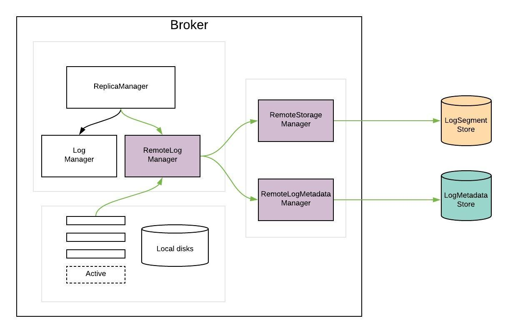

https://cwiki.apache.org/confluence/display/KAFKA/KIP-405%3A+Kafka+Tiered+Storage

# Motivation
** Kafka as a long-term storage service. 减少成本，增加可追溯的时间. **
受本地硬盘的约束，我们只能保存一段时间的数据. 而且硬盘的容量也有上线，有时候我们为了存储更多的数据还需要扩机器。但是实际系统的其他指标还处于一个比较低的水位.
** Kafka local storage and operational complexity **
本地磁盘的运维复杂性高. 比如本地磁盘如果存储的数据比较多，那么在

# Solution - Tiered storage for Kafka
LocalStorage用于存储实时消息，将历史消息保存到远程存储. kafka抽象出来了一个RemoteLogManager (RLM) 来管理Log.
## High-level design

RemoteStorageManager用于管理日志文件和索引、RemoteLogMetadataManager

## RemoteLogManager (RLM)
RLM当前partition是leader或者是follower时，处理是不一样的.
* leader和之前一样，除了之前的功能还负责将已经被滚动的数据保存到远程中，包括对应的索引文件.  在copy之前，本地不会清除这些文件.
* follwer也和之前一样. 同时他还会跟踪RemoteStorageManager的远程索引，用于

Lx  = Local log start offset           Lz  = Local log end offset            Ly  = Last stable offset(LSO)

Ry  = Remote log end offset       Rx  = Remote log start offset

Lz >= Ly >= Lx and Ly >= Ry >= Rx

