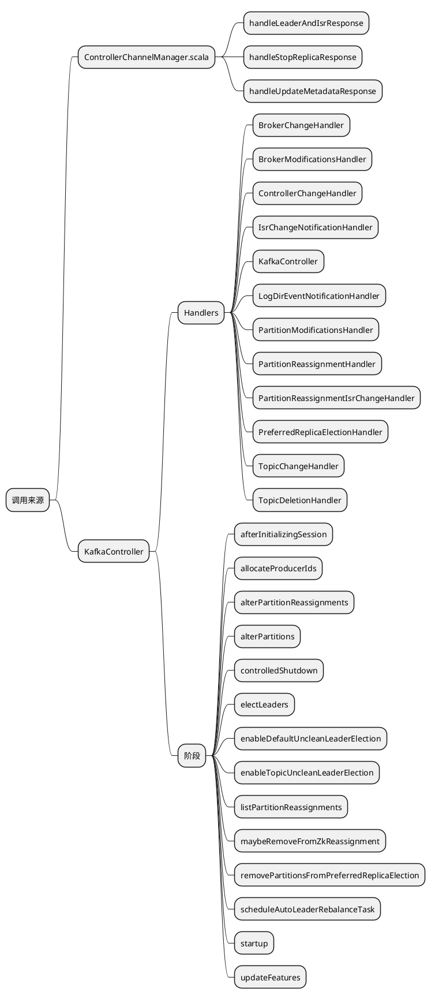

### What
KafkaController是kafka集群的控制器，用于控制整个集群的partition、副本、broker的状态，并与其他broker进行通讯.


# 选主


# 状态保存
先介绍下主要的ControllerContext中几个该章节的用来的成员.


``` scala
class ControllerContext {
 ...
  val allTopics = mutable.Set.empty[String] // 所有topic的集合
  var topicIds = mutable.Map.empty[String, Uuid] // topic和topicids的映射
  val partitionAssignments = mutable.Map.empty[String, mutable.Map[Int, ReplicaAssignment]] // topic、分区、副本之间的关系
  private val partitionLeadershipInfo = mutable.Map.empty[TopicPartition, LeaderIsrAndControllerEpoch] // Partition和LeaderIsrAndControllerEpoch的关系
  val partitionsBeingReassigned = mutable.Set.empty[TopicPartition] // 
  val partitionStates = mutable.Map.empty[TopicPartition, PartitionState] // TopicPartition和PartitionState的关系
  val replicaStates = mutable.Map.empty[PartitionAndReplica, ReplicaState]
  val replicasOnOfflineDirs = mutable.Map.empty[Int, Set[TopicPartition]]
  ...
}
```
# 状态处理器

```scala

 val replicaStateMachine: ReplicaStateMachine = new ZkReplicaStateMachine(config, stateChangeLogger, controllerContext, zkClient,
    new ControllerBrokerRequestBatch(config, controllerChannelManager, eventManager, controllerContext, stateChangeLogger))
  val partitionStateMachine: PartitionStateMachine = new ZkPartitionStateMachine(config, stateChangeLogger, controllerContext, zkClient,
    new ControllerBrokerRequestBatch(config, controllerChannelManager, eventManager, controllerContext, stateChangeLogger))
    
```

#  定时任务
对于controller目前做的定时任务是AutoPreferredReplicaLeaderElection. 通过以下方法
```scala
private[controller] val kafkaScheduler = new KafkaScheduler(1)
 kafkaScheduler.scheduleOnce("auto-leader-rebalance-task",
      () => eventManager.put(AutoPreferredReplicaLeaderElection),
      unit.toMillis(delay)) // leader.imbalance.check.interval.seconds = 300

```

# 启动关闭

# 事件处理
核心是通过ControllerEventManager实现的.

### When



### How

```plantuml
ControllerEventManager->QueuedEvent: put(event: ControllerEvent)
ControllerEventThread->ControllerEventThread: doWork
activate ControllerEventThread
ControllerEventThread->QueuedEvent: pollFromEventQueue
QueuedEvent->ControllerEventThread: ControllerEvent
ControllerEventThread->ControllerEventProcessor: process
deactivate ControllerEventThread
```


# broker通讯
主要通过controllerChannelManager和ControllerBrokerRequestBatch来实现与broker之间的通讯.
Controller和broker存在双向通讯.
Controller->broker主要包含以下请求:
* UpdateMetadataRequest
* LeaderAndIsrRequest
* StopReplicaRequest

Broker->Controller主要包含:
多数为转发

# 实现原理
Controller->broker 主要是由ControllerChannelManager完成的. 核心属性如下:
```scala
class ControllerChannelManager {
  protected val brokerStateInfo = new HashMap[Int, ControllerBrokerStateInfo] // 每个broker一个ControllerBrokerStateInfo对象

  def sendRequest(brokerId: Int, request: AbstractControlRequest.Builder[_ <: AbstractControlRequest],
                  callback: AbstractResponse => Unit = null): Unit = {
    brokerLock synchronized {
      val stateInfoOpt = brokerStateInfo.get(brokerId)
      stateInfoOpt match {
        case Some(stateInfo) =>
          stateInfo.messageQueue.put(QueueItem(request.apiKey, request, callback, time.milliseconds()))
        case None =>
          warn(s"Not sending request $request to broker $brokerId, since it is offline.")
      }
    }
  }
}

case class ControllerBrokerStateInfo(networkClient: NetworkClient, // 通讯客户端
                                     brokerNode: Node, // broker节点信息
                                     messageQueue: BlockingQueue[QueueItem], // AbstractControlRequest queue
                                     requestSendThread: RequestSendThread, // 发送线程
                                     queueSizeGauge: Gauge[Int], 
                                     requestRateAndTimeMetrics: Timer,
                                     reconfigurableChannelBuilder: Option[Reconfigurable])


```

## 线程模型
ControllerChannelManager 会为每一个Broker创建一个RequestSendThread线程，使用的生产和消费设计模式处理ControlRequest，并将ControlResponse发给上游传递的callback

``` 
生产: SomeWhere -> ControllerChannelManager.SendRequest(ControlRequest) -> messageQueue[brokerId]
消费: RequestSendThread[brokerId]-> networkClient.sendAndReceive(ControlRequest) -> callback(ControlResponse)
```


```scala

abstract class AbstractControllerBrokerRequestBatch(config: KafkaConfig,
                                                    controllerContext: ControllerContext, stateChangeLogger: StateChangeLogger) extends Logging {
  val controllerId: Int = config.brokerId
  val leaderAndIsrRequestMap = mutable.Map.empty[Int, mutable.Map[TopicPartition, LeaderAndIsrPartitionState]]
  val stopReplicaRequestMap = mutable.Map.empty[Int, mutable.Map[TopicPartition, StopReplicaPartitionState]]
  val updateMetadataRequestBrokerSet = mutable.Set.empty[Int]
  val updateMetadataRequestPartitionInfoMap = mutable.Map.empty[TopicPartition, UpdateMetadataPartitionState]

```


