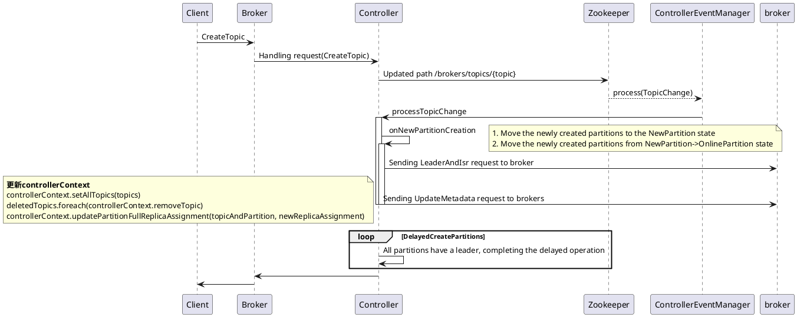

# 总结：

创建topic的整体流程如下. 关注状态转换和ISR这块会在对应的章节展开.



# 创建

1. 命令行创建topic

```shell
./bin/kafka-topics 
```

实际调用的是

```shell
exec $(dirname $0)/kafka-run-class.sh kafka.admin.TopicCommand "$@"
```

2. TopicCommand通过KafkaAdminClient向kafkaController发送createTopics请求.
   代码里是一些验证和封装请求，处理返回，不是关键步骤这里略过

```java
class KafkaAdminClient {
    public CreateTopicsResult createTopics(final Collection<NewTopic> newTopics,
                                           final CreateTopicsOptions options) {
        final Map<String, KafkaFutureImpl<TopicMetadataAndConfig>> topicFutures = new HashMap<>(newTopics.size());
        final CreatableTopicCollection topics = new CreatableTopicCollection();
        for (NewTopic newTopic : newTopics) {
            if (topicNameIsUnrepresentable(newTopic.name())) {
                KafkaFutureImpl<TopicMetadataAndConfig> future = new KafkaFutureImpl<>();
                future.completeExceptionally(new InvalidTopicException("The given topic name '" +
                        newTopic.name() + "' cannot be represented in a request."));
                topicFutures.put(newTopic.name(), future);
            } else if (!topicFutures.containsKey(newTopic.name())) {
                topicFutures.put(newTopic.name(), new KafkaFutureImpl<>());
                topics.add(newTopic.convertToCreatableTopic());
            }
        }
        if (!topics.isEmpty()) {
            final long now = time.milliseconds();
            final long deadline = calcDeadlineMs(now, options.timeoutMs());
            final Call call = getCreateTopicsCall(options, topicFutures, topics,
                    Collections.emptyMap(), now, deadline);
            runnable.call(call, now);
        }
        return new CreateTopicsResult(new HashMap<>(topicFutures));
    }
}
```

3. KafkaController接受到请求后验证. 并调用zk创建topic

```scala
class ZkAdminManager {
  def createTopics(timeout: Int,
                   validateOnly: Boolean,
                   toCreate: Map[String, CreatableTopic],
                   includeConfigsAndMetadata: Map[String, CreatableTopicResult],
                   controllerMutationQuota: ControllerMutationQuota,
                   responseCallback: Map[String, ApiError] => Unit):
  // 1.map over topics creating assignment and calling zookeeper

  try {
    // 验证config、topic是否存在
  ...
    // 设置分区和replicat数量
    val resolvedNumPartitions = if (topic.numPartitions == NO_NUM_PARTITIONS)
      defaultNumPartitions /*num.partitions*/
    else topic.numPartitions
    val resolvedReplicationFactor = if (topic.replicationFactor == NO_REPLICATION_FACTOR)
      defaultReplicationFactor /*default.replication.factor*/
    else topic.replicationFactor
    val assignments = if (topic.assignments.isEmpty) {
      // 没有分配assignments需根据算法分配assignments
      AdminUtils.assignReplicasToBrokers(
        brokers, resolvedNumPartitions, resolvedReplicationFactor)
    } else {
      val assignments = new mutable.HashMap[Int, Seq[Int]]
      topic.assignments.forEach { assignment =>
        assignments(assignment.partitionIndex) = assignment.brokerIds.asScala.map(a => a: Int)
      }
      assignments
    }
    controllerMutationQuota.record(assignments.size)
    // 在zk中创建节点
    // /brokers/topics/{topic}/{partition}
    adminZkClient.createTopicWithAssignment(topic.name, configs, assignments, validate = false, config.usesTopicId)
    populateIds(includeConfigsAndMetadata, topic.name)
    CreatePartitionsMetadata(topic.name, assignments.keySet)
  }


  // 2. if timeout <= 0, validateOnly or no topics can proceed return immediately
  if (timeout <= 0 || validateOnly || !metadata.exists(_.error.is(Errors.NONE))) {
    val results = metadata.map { createTopicMetadata =>
      // ignore topics that already have errors
      if (createTopicMetadata.error.isSuccess && !validateOnly) {
        (createTopicMetadata.topic, new ApiError(Errors.REQUEST_TIMED_OUT, null))
      } else {
        (createTopicMetadata.topic, createTopicMetadata.error)
      }
    }.toMap
    responseCallback(results)
  } else {
    // 3. else pass the assignments and errors to the delayed operation and set the keys
    val delayedCreate = new DelayedCreatePartitions(timeout, metadata, this,
      responseCallback)
    val delayedCreateKeys = toCreate.values.map(topic => TopicKey(topic.name)).toBuffer
    // try to complete the request immediately, otherwise put it into the purgatory
    topicPurgatory.tryCompleteElseWatch(delayedCreate, delayedCreateKeys)
  }
```

此时在zk的/brokers/topics/{topic}中保存信息如下.

```
{"partitions":{"11":[1,3,4],"0":[0,1,2],"1":[1,2,3],"2":[2,3,4],"3":[3,4,0],"4":[4,0,1],"5":[0,2,3],"6":[1,3,4],"7":[2,4,0],"8":[3,0,1],"9":[4,1,2],"10":[1,2,3]},"adding_replicas":{},"removing_replicas":{},"version":3}
```

4. KafkaController监控/brokers/topics/{topic}变化调用processTopicChange()，可以看一下下边的注释. 主要维护controllerContext

```scala
class KafkaController() {
  private def processTopicChange(): Unit = {
    // 验证自己是否是broker
    if (!isActive) return
    // 从zk获取所有现有的topic `/brokers/topics/{topic}/{partition}`
    val topics = zkClient.getAllTopicsInCluster(true)
    // 计算出新的topic
    val newTopics = topics -- controllerContext.allTopics
    val deletedTopics = controllerContext.allTopics.diff(topics)
    // 设置当前controllerContext.allTopics
    controllerContext.setAllTopics(topics)

    // 给新topic注册 `PartitionModificationsHandler` 下边描述.
    registerPartitionModificationsHandlers(newTopics.toSeq)
    // 从zk新topic的分区和副本信息
    val addedPartitionReplicaAssignment = zkClient.getReplicaAssignmentAndTopicIdForTopics(newTopics)
    // 从controllerContext中删除topic. 下边单独描述
    deletedTopics.foreach(controllerContext.removeTopic)
    // 设置topicid
    processTopicIds(addedPartitionReplicaAssignment)
    //更新 controllerContext的Partition和Replica的关系.
    addedPartitionReplicaAssignment.foreach { case TopicIdReplicaAssignment(_, _, newAssignments) =>
      newAssignments.foreach { case (topicAndPartition, newReplicaAssignment) =>
        controllerContext.updatePartitionFullReplicaAssignment(topicAndPartition, newReplicaAssignment)
      }
    }
    info(s"New topics: [$newTopics], deleted topics: [$deletedTopics], new partition replica assignment " +
      s"[$addedPartitionReplicaAssignment]")
    if (addedPartitionReplicaAssignment.nonEmpty) {
      val partitionAssignments = addedPartitionReplicaAssignment
        .map { case TopicIdReplicaAssignment(_, _, partitionsReplicas) => partitionsReplicas.keySet }
        .reduce((s1, s2) => s1.union(s2))
      //创建topic相关变化的监听
      onNewPartitionCreation(partitionAssignments)
    }
  }
}
```

``` scala
  /**
   * This callback is invoked by the topic change callback with the list of failed brokers as input.
   * It does the following -
   * 1. Move the newly created partitions to the NewPartition state
   * 2. Move the newly created partitions from NewPartition->OnlinePartition state
   */
  private def onNewPartitionCreation(newPartitions: Set[TopicPartition]): Unit = {
    info(s"New partition creation callback for ${newPartitions.mkString(",")}")
    // 调用partitionStateMachine，维护controllerContext.partitionStates. 先设置controllerContext partition为NonExistentPartition再设置为NewPartition. 不发送controllerBrokerRequestBatch.
    partitionStateMachine.handleStateChanges(newPartitions.toSeq, NewPartition)
    // 调用replicaStateMachine,维护controllerContext.replicaStates. 将replica的状态设置为 NewReplica. 不发送controllerBrokerRequestBatch.
    replicaStateMachine.handleStateChanges(controllerContext.replicasForPartition(newPartitions).toSeq, NewReplica)
    
    // 调用replicaStateMachine,维护controllerContext.replicaStates. 将replica的状态设置为NewReplica.
    partitionStateMachine.handleStateChanges(
      newPartitions.toSeq,
      OnlinePartition,
      Some(OfflinePartitionLeaderElectionStrategy(false))
    )
    replicaStateMachine.handleStateChanges(controllerContext.replicasForPartition(newPartitions).toSeq, OnlineReplica)
  }

```
